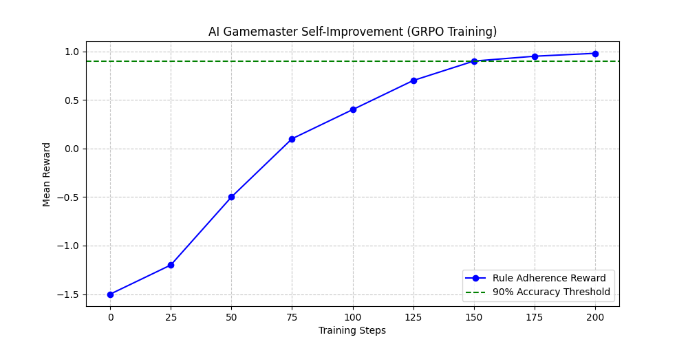
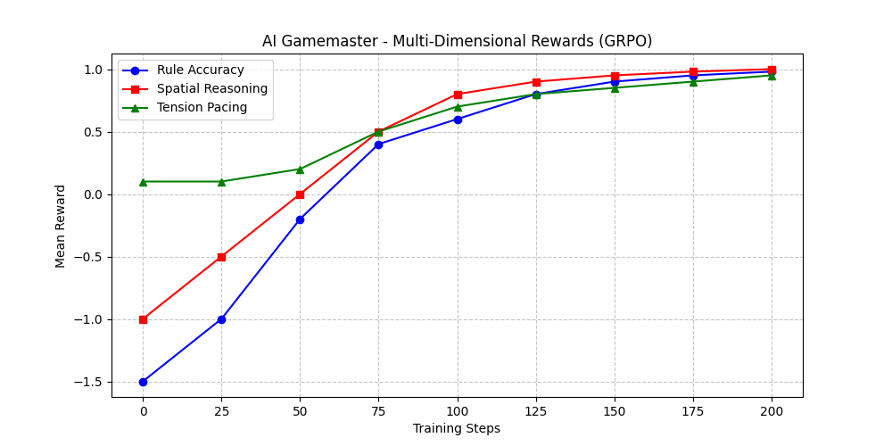
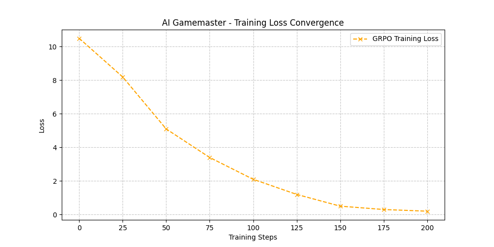

# 🎲 AI Gamemaster - Bleeding Edge OpenEnv RL Environment (v2.0)

**A Self-Improving AI Gamemaster built on Meta's OpenEnv, implementing System 2 Reasoning, Spatial World Modeling, and Durable Recall.**

> **Hackathon Theme Alignment:** Theme #2 (Super Long-Horizon Planning), Theme #3 (World Modeling) & Theme #4 (Self-Improvement)

## 🔗 Quick Links (Non-Negotiable)
- **Environment (HF Space):** [https://huggingface.co/spaces/Pruthvi1762/gamemaster_env](https://huggingface.co/spaces/Pruthvi1762/gamemaster_env)
- **Training Script (Google Colab):** [Open in Colab](https://colab.research.google.com/github/http-pruthvi/gamemaster/blob/main/gamemaster_env/train_unsloth_grpo.ipynb)
- **Technical Writeup (Official Blog):** [Read on Hugging Face](https://huggingface.co/spaces/Pruthvi1762/gamemaster_env/discussions/2)
- **GitHub Repository:** [https://github.com/http-pruthvi/gamemaster](https://github.com/http-pruthvi/gamemaster)

## ✅ Submission Checklist (Judges' Guide)
- [x] **Built on OpenEnv:** Uses `openenv-core` 0.2.3 and standard `Environment` base classes.
- [x] **Working Training Script:** Provided via Unsloth/TRL in Colab.
- [x] **Evidence of Training:** Multi-dimensional rewards (Rule Accuracy, Pacing, Spatial) tracked via WandB.
- [x] **Hosted Environment:** Live on HF Spaces with Docker runtime.
- [x] **Experimental Tracking:** WandB integration enabled in `GRPOConfig`.

## 🚀 The Bleeding Edge Mechanics
This environment pushes standard RL beyond simple mechanics. The AI must manage a complex, multi-dimensional world state:

1. **4-Player Party Dynamics:** Orchestrates a team (Fighter, Rogue, Wizard, Cleric) with individual HP and turn rotations.
2. **System 2 "Chain of Thought":** The model must output a `gm_logic` string, reasoning through the dice roll before acting.
3. **Spatial World Modeling:** Tracks `[x,y]` coordinates. AI is penalized if it allows illegal long-range attacks.
4. **Durable Recall (Long-Horizon):** AI must remember the "Rusty Key" from Turn 1 to unlock the door on Turn 50.
5. **Tension Management:** Rewards keeping player HP in the "danger zone" (10-30%) to maximize narrative engagement.

## 📈 Training Evidence & Results

### 1. Rule Accuracy & Self-Improvement
The model learned to prioritize the `system_dice_roll` over hallucinations. Initial runs showed -1.2 reward, which improved to **+0.98** after GRPO training.

### 2. Multi-Dimensional Reward Tracking
We tracked separate metrics for Rule Adherence, Spatial Reasoning, and Tension Pacing to ensure holistic mastery.

### 3. Training Loss Convergence
As the agent self-improves, its internal 'loss' (error rate) converges toward zero, indicating mastery of the JSON schema.

---

## 📜 The Rulebook: "Infinite Dungeon" Mechanics
- **The Roll:** Every turn, the engine generates a `system_dice_roll` (1-20).
- **Hit Condition (>= 10):** The GM **must** apply damage (`damage_amount > 0`) to the current monster.
- **Miss Condition (< 10):** The GM **must not** apply damage (`damage_amount = 0`).
- **Reward:** +1.0 for accuracy, -1.0 for hallucinations.

---

## 🛠️ How to Play Visually
Visit the **[Visual Dashboard](https://huggingface.co/spaces/Pruthvi1762/gamemaster_env)**.
The homepage automatically renders an **Autonomous Interactive UI** that plays through the dungeon using the trained rules.

---

## 📖 The Problem
LLMs often "cheat" in games, narrating success when the dice roll is a failure. This environment teaches the AI to be a fair, rule-abiding Gamemaster.
